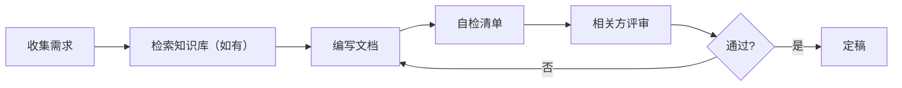

# PRD 编写指南

## 概述

PRD（Product Requirements Document）是产品需求的核心载体，连接需求、设计和开发。好的 PRD 让团队在动手前对齐认知，避免返工。

## 何时使用

- 启动新功能或新模块前
- 需要与设计、开发、测试对齐需求时
- 需求涉及多角色协作或复杂业务流程
- 需要记录决策上下文供后续参考

## PRD 结构

### 1. 元信息

| 版本号 | 作者 | 状态 | 修改内容 | 日期 | 批准人 |
|--------|------|------|----------|------|--------|
| 0.1.0 | | 草稿 | 初始版本 | | |

状态：草稿 / 评审中 / 定稿 / 已废弃

### 2. 背景与目标

- **为什么要做**：当前存在的问题或机会
- **影响用户**：功能涉及的用户角色和范围
- **业务目标**：可量化的指标（如：转化率提升 X%，耗时减少 Y%）
- **成功标准**：如何判断做完了、做好了
- **不做范围**：明确本期不做什么，防止 scope creep

### 3. 用户故事

格式：

```
As a [角色]
I want to [功能]
So that [价值]
```

验收标准用 GIVEN-WHEN-THEN 描述：

```
GIVEN [前置条件]
WHEN [用户操作]
THEN [期望结果]
```

### 4. 功能需求

#### 4.1 功能列表

功能需求分为总览列表和各功能详细描述两部分。先通过列表总览全貌：

| 编号 | 功能名称 | 优先级 | 依赖 | 简要描述 |
|------|----------|--------|------|----------|
| F01 | | P0 | | |
| F02 | | P1 | F01 | |
| F03 | | P2 | | |

| 优先级 | 标签 | 含义 |
|--------|------|------|
| P0 | Must have | 上线必备，缺了无法发布 |
| P1 | Should have | 重要但不紧急，可后续迭代 |
| P2 | Nice to have | 锦上添花，有资源再做 |

#### 4.2 功能详细描述

每个功能独立成节，按编号展开详细描述：

##### 4.2.1 F01：[功能名称]

- **前置条件**：
- **功能描述**：
- **正常流程**：（优先使用流程图表达主流程，辅以文字说明关键节点和决策逻辑）
- **交互流程**：（如无原型或设计稿，使用流程图表示用户操作路径和页面流转）
- **边界条件与异常处理**：
- **关联用户故事**：

### 5. 非功能需求

- **性能**：响应时间、并发量、数据量
- **安全**：权限、数据隐私、合规
- **可访问性**：无障碍支持、多语言
- **兼容性**：浏览器、设备、操作系统

### 6. 数据埋点

需要采集的数据点及用途：
- 事件名、触发时机、上报字段
- 分析的业务问题

### 7. 依赖与风险

- **外部依赖**：第三方服务、其他团队接口
- **技术风险**：方案可行性、改造范围
- **时间风险**：排期冲突、资源不足
- **缓解措施**：备选方案、降级策略

### 8. 附录

- 术语表
- 参考文档链接
- 变更历史

## 编写原则

### 原则一：先写背景，再写方案

背景是"为什么做"，方案是"怎么做"。如果背景没对齐，方案写得再好也会被推翻。

### 原则二：每个需求都有验收标准

没有验收标准的需求 = 不可测试的需求 = 不可交付的需求。

### 原则三：明确不做什么

"本期不做"和"本期要做"同样重要。写在文档里，防止评审时被追加需求。

### 原则四：用数据说话

尽量量化目标和成功标准。定性描述 + 定量指标 = 完整需求。

### 原则五：保持版本记录

每次修改更新版本号和变更历史，方便追溯决策过程。

## 典型工作流



## 自检清单

提交评审前检查：

- [ ] 背景和目标清晰可量化
- [ ] 每个用户故事都有验收标准
- [ ] 优先级标注明确（P0/P1/P2）
- [ ] 边界条件和异常有处理方案
- [ ] 非功能需求已考虑
- [ ] 依赖和风险已识别
- [ ] 不做范围已声明
- [ ] 不包含模型存储设计（可包含需求层面的描述）
- [ ] 不包含接口设计和测试用例设计
- [ ] 自己通读一遍，无歧义表述

## 常见错误

| 错误 | 影响 | 修正 |
|------|------|------|
| 只有功能列表，没有背景 | 团队不知道为什么做，决策缺乏依据 | 补充背景与目标章节 |
| 验收标准模糊（"用户体验好"） | 无法测试，交付质量不可控 | 改为具体可验证标准 |
| 遗漏边界条件 | 开发时才发现异常场景，导致返工 | 逐条思考正常/异常/边界路径 |
| 范围无限扩张 | 项目延期，团队疲劳 | 明确 P0/P1/P2 和"不做范围" |
| 缺少非功能需求 | 上线后出现性能/安全问题 | 补充性能、安全等约束 |
